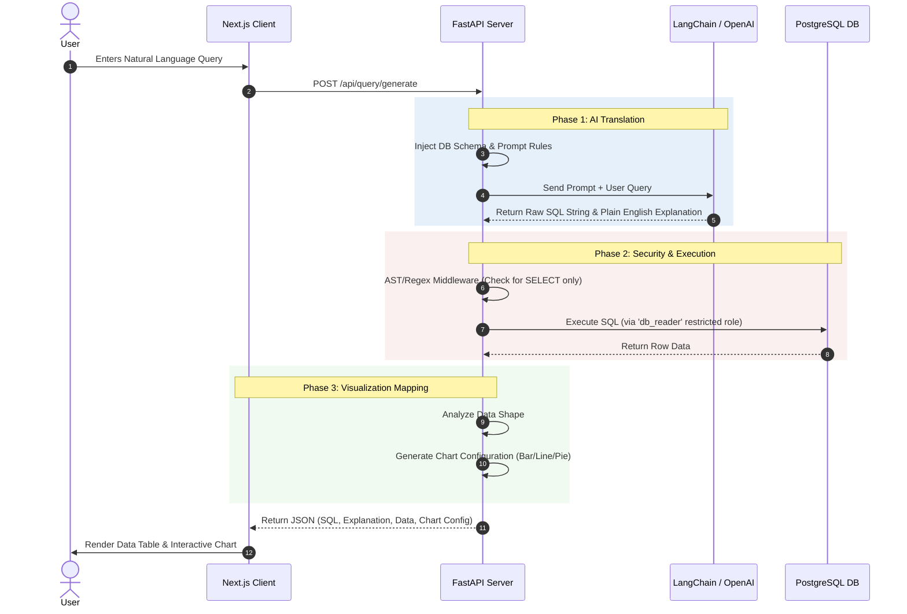

# System Architecture

## 1. High-Level Overview
This application utilizes a decoupled, three-tier architecture augmented by an external AI service. 
The system is designed to transform natural language into safe, verifiable SQL, execute it against a provisioned PostgreSQL database, and return dynamic visual results.

## 2. Technology Stack
*   **Frontend:** Next.js (React), Tailwind CSS, Zustand, Recharts
*   **Backend:** FastAPI (Python), Uvicorn, SQLAlchemy
*   **Database:** PostgreSQL (Dockerized for development)
*   **AI Orchestration:** LangChain
*   **LLM Provider:** OpenAI API (GPT-4o or GPT-3.5-Turbo)

## 3. Core System Data Flow
The process of turning text into a visualization follows a strict, sequential flow to guarantee security and data integrity.

## 4. Security Boundaries
Because executing AI-generated code introduces extreme risk vectors, the architecture enforces security at three distinct layers:

1.  **AI Layer Boundary:** The LLM system prompt forcefully denies DML operations. However, LLMs can hallucinate and disobey, meaning this boundary is treated as "soft."
2.  **Application Layer Boundary:** FastAPI utilizes an Abstract Syntax Tree (AST) parser or aggressive Regex to intercept the query before DB connection. If keywords like `DROP`, `ALTER`, `DELETE`, `UPDATE`, or `INSERT` are detected, the request is immediately rejected with a 400 status.
3.  **Database Layer Boundary:** The ultimate failsafe. The backend connects to PostgreSQL using a dedicated `db_reader` role. This role is explicitly granted exactly zero permission to mutate data or alter schemas. If the first two layers fail, the database engine will reject the query intrinsically.
