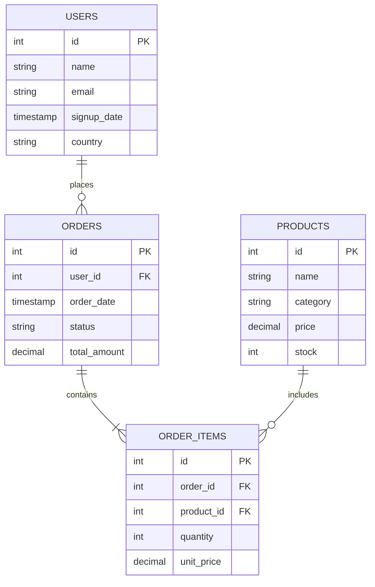

# Database Schema & Data Dictionary

## 1. Overview
This document defines the PostgreSQL schema for the mock E-Commerce environment. This schema serves two purposes:
1. Acting as the sandbox data for user queries.
2. Serving as the exact text injected logically into the LLM context limits so the AI understands available parameters.

## 2. Entity-Relationship (ER) Diagram

## 3. Table Definitions

### `users`
Represents the customers of the e-commerce platform.
| Column | Type | Constraints | Description |
|---|---|---|---|
| `id` | SERIAL | PRIMARY KEY | Unique user identifier |
| `name` | VARCHAR(255) | NOT NULL | Full name of the user |
| `email` | VARCHAR(255) | UNIQUE, NOT NULL | User's email address |
| `signup_date` | TIMESTAMP | DEFAULT NOW() | When the user joined |
| `country` | VARCHAR(100) | | Country of origin |

### `products`
Represents the items available for purchase in the store.
| Column | Type | Constraints | Description |
|---|---|---|---|
| `id` | SERIAL | PRIMARY KEY | Unique product identifier |
| `name` | VARCHAR(255) | NOT NULL | Product name |
| `category` | VARCHAR(100) | | e.g., 'Electronics', 'Apparel' |
| `price` | DECIMAL(10,2) | NOT NULL | Current price of the product |
| `stock` | INT | DEFAULT 0 | Remaining inventory |

### `orders`
Represents a single checkout cart event by a user.
| Column | Type | Constraints | Description |
|---|---|---|---|
| `id` | SERIAL | PRIMARY KEY | Unique order identifier |
| `user_id` | INT | FOREIGN KEY (`users.id`) | The user who placed the order |
| `order_date` | TIMESTAMP | DEFAULT NOW() | When the order occurred |
| `status` | VARCHAR(50) | | e.g., 'Completed', 'Pending', 'Shipped' |
| `total_amount` | DECIMAL(10,2) | NOT NULL | Total cost of the order |

### `order_items`
Represents individual products within a specific order (many-to-many join table).
| Column | Type | Constraints | Description |
|---|---|---|---|
| `id` | SERIAL | PRIMARY KEY | Unique item row identifier |
| `order_id` | INT | FOREIGN KEY (`orders.id`) | The parent order |
| `product_id` | INT | FOREIGN KEY (`products.id`) | The specific product purchased |
| `quantity` | INT | NOT NULL | Number of units purchased |
| `unit_price`| DECIMAL(10,2) | NOT NULL | Price per unit at time of purchase |

## 4. Target Query Use-Cases
The schema is designed to evaluate the LLM's capacity for complex operations. Examples of questions this schema handles:
*   *Basic:* "Show me all users from Canada."
*   *Aggregation:* "What is the total revenue grouped by product category?"
*   *Complex JOINs:* "Who are the top 5 customers by total lifetime spend, and what was their most recent purchase date?"
*   *Date Filtering:* "How many electronics orders were placed last month?"
